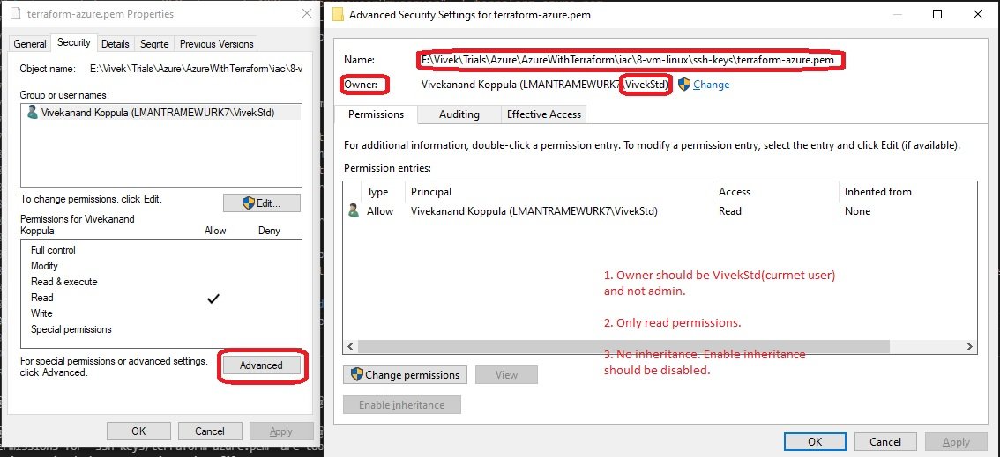

If you want to learn more about creating good readme files then refer the following [guidelines](https://docs.microsoft.com/en-us/azure/devops/repos/git/create-a-readme?view=azure-devops). You can also seek inspiration from the below readme files:
- [ASP.NET Core](https://github.com/aspnet/Home)
- [Visual Studio Code](https://github.com/Microsoft/vscode)
- [Chakra Core](https://github.com/Microsoft/ChakraCore)

# Some useful commands

az account show

az account list

az account set --subscription "Microsoft Azure Sponsorship"

az account set --subscription "Mewurk - DevTest"

 - The following needs to be used in azure powershell
Get-AzResourceGroup

Select-AzSubscription -SubscriptionName "Microsoft Azure Sponsorship"

Get-AzResourceGroup

0. To clean up, do the following.
    a. First find .pem files. 

    b. Then reset the permission for those files. Navigate to those folders. 

    c. Then execute the follwng command(admin prvilages are needed.)

    icacls.exe .\terraform-azure.pem /reset 

    d. Next delete all of the folder contents.

    e. Next do git clone https://vivek7dm@dev.azure.com/vivek7dm/Terraform/_git/AzureWithTerraform .
  
1. create-rg-azuredocs: https://docs.microsoft.COM/en-us/azure/developer/terraform/create-resource-group?tabs=azure-cli

2. 5-virtual-network: Here we are creating vnet. First a resource group is created. Then some network related resources are created in that resource group.
    
    Ref: [09-Resource-Syntax-and-Behavior](https://github.com/stacksimplify/hashicorp-certified-terraform-associate-on-azure/tree/main/09-Resource-Syntax-and-Behavior)

6. 6-meta-arg-without-depends-on. Create Public IP resource without the depends_on meta arg.
7. 7-meta-arg-with-depends-on. Create Public IP resource with the depends_on meta arg. When the plan is executed, the public ip resource is created only after the virtual network and subnet.

8. To generate ssh keys, 

    Start-Service sshd

    Open power shell with Admin rights.

    Follow this https://superuser.com/a/1689978/674525 to login to ssh server. 

    Run the following command.

    if (!(Get-NetFirewallRule -Name "OpenSSH-Server-In-TCP" -ErrorAction SilentlyContinue | Select-Object Name, Enabled)) {
        Write-Output "Firewall Rule 'OpenSSH-Server-In-TCP' does not exist, creating it..."
        New-NetFirewallRule -Name 'OpenSSH-Server-In-TCP' -DisplayName 'OpenSSH Server (sshd)' -Enabled True -Direction Inbound -Protocol TCP -Action Allow -LocalPort 22
    } else {
        Write-Output "Firewall rule 'OpenSSH-Server-In-TCP' has been created and exists."
    }

    Run the following command and note the name.

    [System.Security.Principal.WindowsIdentity]::GetCurrent().Name

    ssh MYMACHINENAME\AdminUser@localhost 

    Next cd into the folder you need. For example

    cd E:\Vivek\Trials\Azure\AzureWithTerraform\iac\8-vm-linux\ssh-keys

    Finally run the following command. 
    `ssh-keygen -m PEM -t rsa -b 4096 -C "azureuser@myserver" -f terraform-azure.pem`
    From windows explorer rename terraform-azure.pem.pub to terraform-azure.pub. Note admin permission may be needed.
    Once the keys are generated, we need to assign the CHMOD 400 Permissions. 

    # The following is not working.
    Look at this you tube vide titled [How to do the CHMOD 400 Equivalent Command on Windows](https://www.youtube.com/watch?v=P1erVo5X3Bs)
    Run the following three commands, in am admin powershell.

    icacls.exe .\terraform-azure.pem /reset
    In the following VivekStd is the current logged in user
    icacls.exe .\terraform-azure.pem /grant:r "$("VivekStd"):(r)"
    icacls.exe .\terraform-azure.pem /inheritance:r

    Note here, VivekStd is the current user name on my machine.

    In the you tube video, the following command is suggested.
    icacls.exe .\terraform-azure.pem /grant:r "$($env:username):(r)". Do not use this. Here $env:username is for the admin user used for powershell.

    # The above icacls is not working. So do the following.
    Right click the pem file and select properties. Then select the security tab.

    

    Ensure that the vm is created and running. Get the ip address assigned. In this case its 20.198.64.249
    Now run the command
    ssh -i ssh-keys/terraform-azure.pem azureuser@20.198.64.249
    Now you should be logged in. 
    Verify the folders, cd /var/www/html. This should contain app1 folder and the file index.html
    

    Browse the following.
    http://20.198.64.249
    http://20.198.64.249/app1/index.html
    http://20.198.64.249/app1/metadata.html

    Also go to the ip address resource that got created. It should have an dns name that looks something like this app1-vm-autqly.centralindia.cloudapp.azure.com.

    app1-vm-autqly.centralindia.cloudapp.azure.com
    app1-vm-autqly.centralindia.cloudapp.azure.com/app1/index.html
    app1-vm-autqly.centralindia.cloudapp.azure.com/app1/metadata.html

    
    

