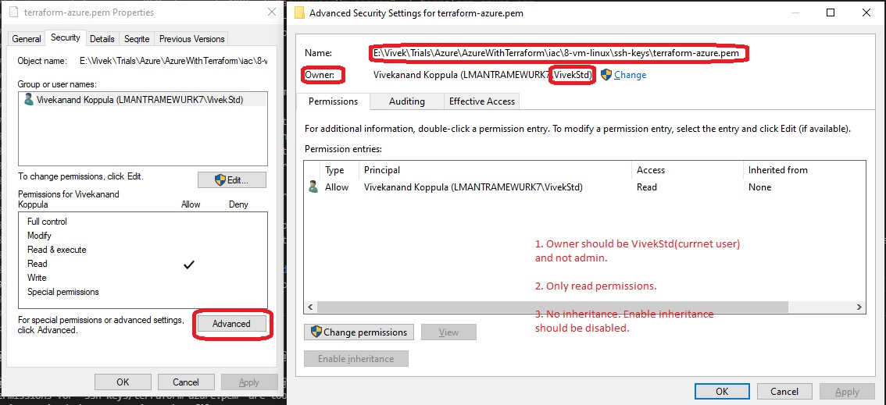

You need to first create Ssh keys in ssh folder.

For that [ensure Open Ssh is installed on your computer as follows](https://docs.microsoft.com/en-us/windows-server/administration/openssh/openssh_install_firstuse#install-openssh-using-powershell).

1. Open power shell with admin rights and run the following command. 
   Get-WindowsCapability -Online | Where-Object Name -like 'OpenSSH*'
2. If not already installed, then install using the following commands
   # Install the OpenSSH Client
   Add-WindowsCapability -Online -Name OpenSSH.Client~~~~0.0.1.0

   # Install the OpenSSH Server
   Add-WindowsCapability -Online -Name OpenSSH.Server~~~~0.0.1.0
3. [Start and configure Open SSh as follows](https://docs.microsoft.com/en-us/windows-server/administration/openssh/openssh_install_firstuse#start-and-configure-openssh-server).

```t 
# Start the sshd service
Start-Service sshd

# OPTIONAL but recommended:
Set-Service -Name sshd -StartupType 'Automatic'

# Confirm the Firewall rule is configured. It should be created automatically by setup. Run the following to verify
if (!(Get-NetFirewallRule -Name "OpenSSH-Server-In-TCP" -ErrorAction SilentlyContinue | Select-Object Name, Enabled)) {
    Write-Output "Firewall Rule 'OpenSSH-Server-In-TCP' does not exist, creating it..."
    New-NetFirewallRule -Name 'OpenSSH-Server-In-TCP' -DisplayName 'OpenSSH Server (sshd)' -Enabled True -Direction Inbound -Protocol TCP -Action Allow -LocalPort 22
} else {
    Write-Output "Firewall rule 'OpenSSH-Server-In-TCP' has been created and exists."
}
```

4.  Run the following command and note the name.


        [System.Security.Principal.WindowsIdentity]::GetCurrent().Name

    ssh MYMACHINENAME\AdminUser@localhost 

    Give the password as needed. 

    Now cd into the folder as needed where you wnat to create the ssh keys in.
    cd into the folder where you want to create the ssh keys.

5.  Finally run the following command to generate the keys. 
   `ssh-keygen -m PEM -t rsa -b 4096 -C "azureuser@myserver" -f terraform-azure.pem`

    Enter blank password(just press enter) since this is just an example.
    Ensure the keys are created.
6.  Next rename the terraform-azure.pem.pub to terraform-azure.pub. Just remove pem. This needs admin privilages. So do not do this from Vs Code explorer Rename facility.
    
    You can use the admin powershell and run the following command Rename-Item -Path "terraform-azure.pem.pub" -NewName "terraform-azure.pub"

7.  Now ensure proper permission on the private key. Right click the pem file and select properties. Then select the security tab. Do this with utmost care and full focus.

    

8.  Now procced to create the vm. Run the terraform commands.
   
9.  Once created, get the dns name and ip address of the newly created vm.
 
    Also go to the ip address resource that got created. It should have an dns name that looks something like this app1-vm-autqly.centralindia.cloudapp.azure.com.

10. Wait for a few minutes and then Browse and see if they are accessible. 
    
11. http://20.198.64.249
    
    http://20.198.64.249/app1/index.html

    http://20.198.64.249/app1/metadata.html

    app1-vm-autqly.centralindia.cloudapp.azure.com

    app1-vm-autqly.centralindia.cloudapp.azure.com/app1/index.html

    app1-vm-autqly.centralindia.cloudapp.azure.com/app1/metadata.html

12.     