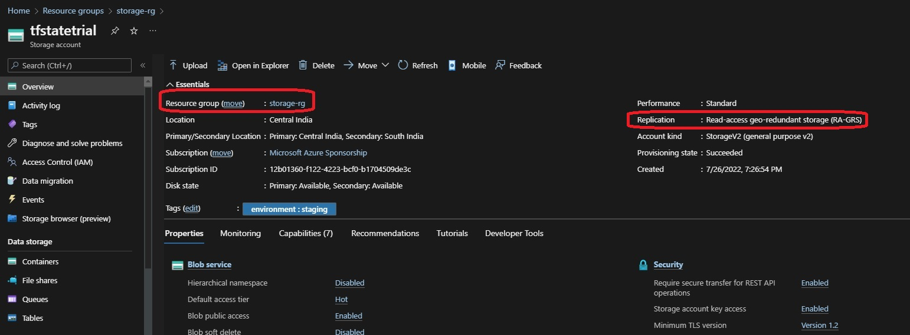

# Remote State Locking.

- This Provisions Azure state storage 

- This will be pre-requisite for a subsequent example where a remote backend is needed.

- This is essentially needed for provisioning remote state storage

