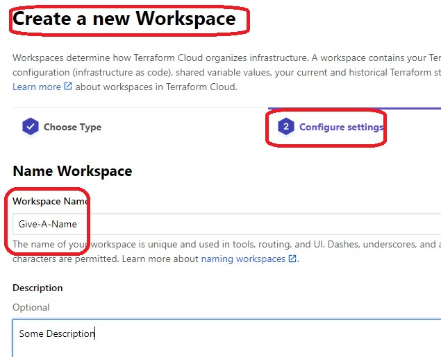
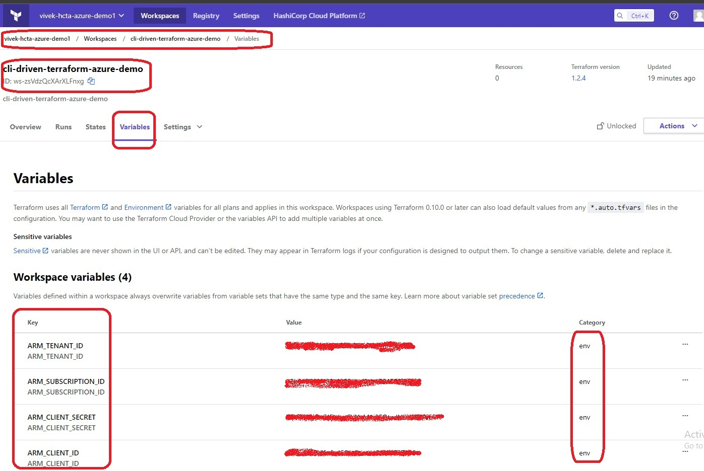

# CLI driven workflow.

## Summary

- This exercise is a simple CLI driven workflow.

- The resources are created on Azure by Terraform. 

- But the tarrafrom tool sitting on terrarom cloud and not on developers machine. 

## Steps

- Create a workspace on cloud as follows. Select Cli Driven Workflow as follows.

- Give a namd and description .

- Add env vars to the workspace.

