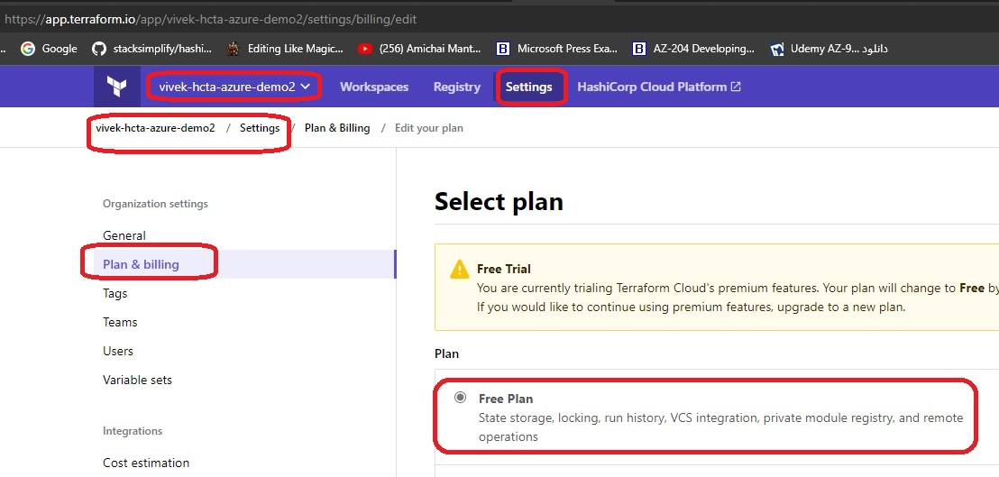
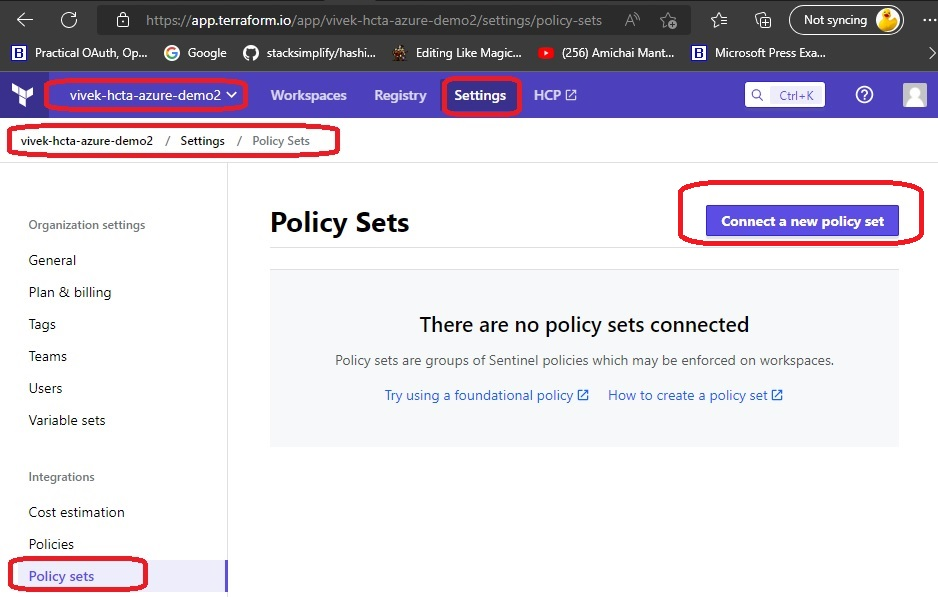
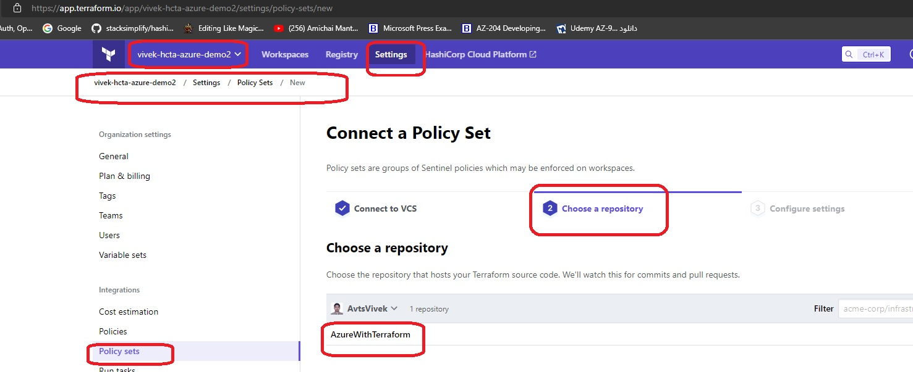
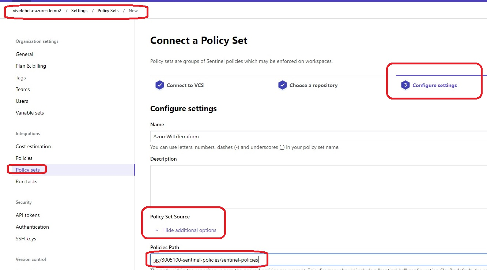

# Sentinel polices.

- This folder contains the policies that are used by the Sentinel.

- These are picked up from [here](https://github.com/hashicorp/terraform-guides/tree/master/governance/third-generation).

- To use them, you first need to create organization on terraform cloud. Then go to planning and billing and change plan to trial

- Then refresh and scroll down to select Policy Sets.

- Choose a Repo

- Configure the settings for the repo. Then scroll down and click connect policy set.

