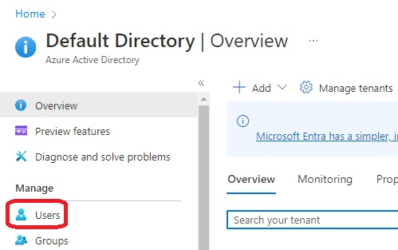
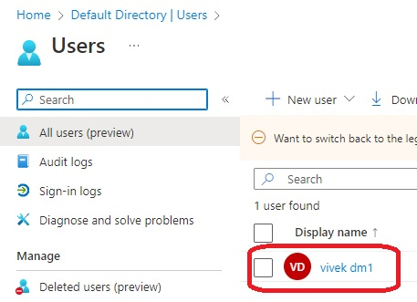
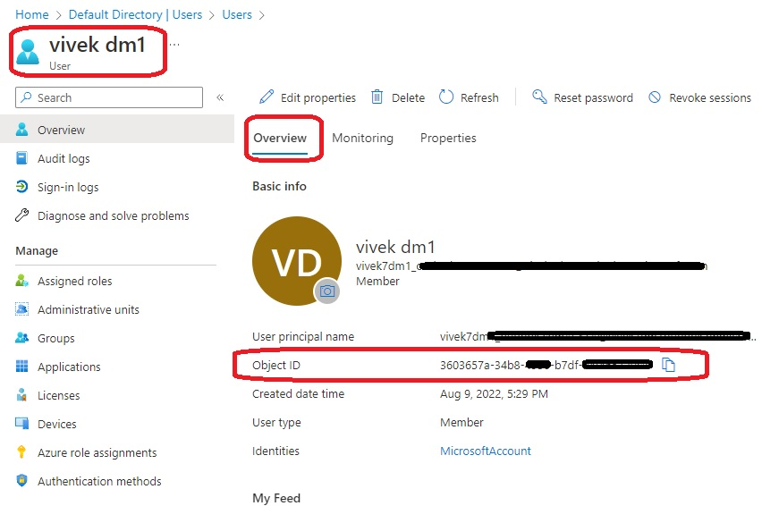
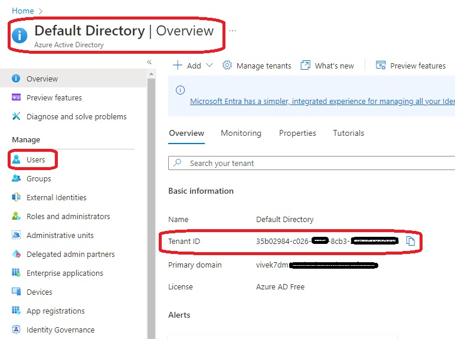

# Data Source

- Introduces Data source in Terraform and demos [azuread_client_config](https://registry.terraform.io/providers/hashicorp/azuread/latest/docs/data-sources/client_config)

- Once applied, see the following images.

- Also see this [so question](https://stackoverflow.com/q/73864584/1977871). 

