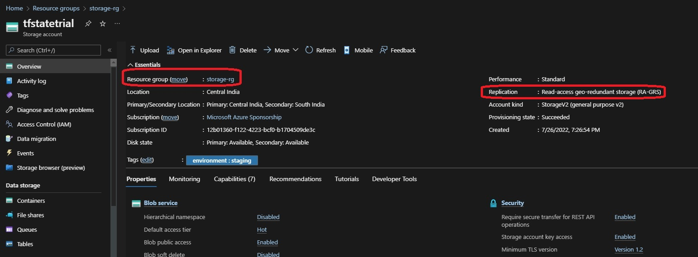
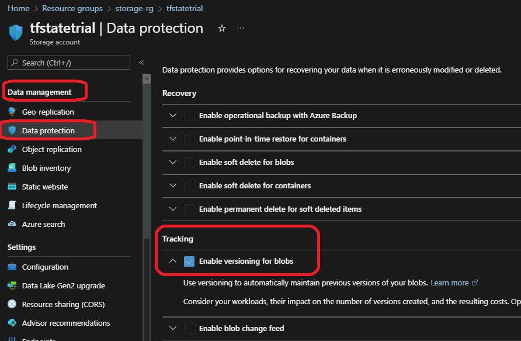
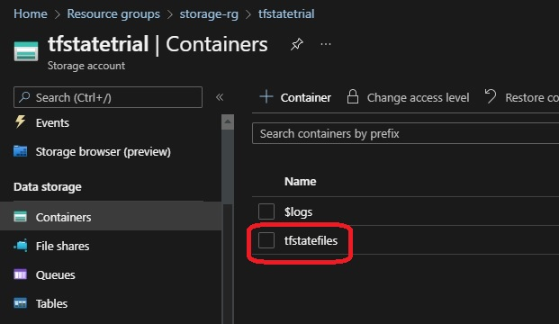

# Remote State Locking.

- This Provisions Azure state storage 

- This will be pre-requisite for a subsequent example where a remote backend is needed.

- This is essentially needed for provisioning remote state storage

- Once created, you can use as follows.
```terraform

    resource_group_name  = "storage-rg"
    storage_account_name = "tfstatetrial"
    container_name       = "tfstatefiles"
    key                  = "terraform.tfstate"

```



- Enable data protection for Azure state storage



- Container Storage



- Getting the following warning when trying to apply.

- So created [this stackoverflow issue](https://stackoverflow.com/q/72727023/1977871)

